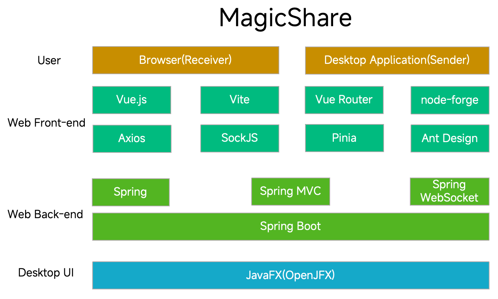

# 神奇分享_**MagicShare**（中文说明）

[**English**](./README_EN.md)

---

Website:

[神奇分享_MagicShare（中文说明） | ZZHow](https://www.zzhow.com/MagicShare)

Source Code:

https://github.com/ZZHow1024/MagicShare

Releases:

https://github.com/ZZHow1024/MagicShare/releases

---

## 它是什么？

MagicShare 是一款跨平台的内网文件分享工具，发送方使用桌面客户端选择需要分享的文件，接收方使用 Web 页面下载分享的文件。

---

## 技术路线

- 编程语言：**Java** 和 **JavaScript**

---

## 许可证

该项目根据 GNU 通用公共许可证 v3.0 获得许可 - 有关详细信息，请参阅 [LICENSE](https://github.com/ZZHow1024/MagicShare/blob/main/LICENSE) 文件。

---

## 用户许可协议

**使用本软件前，请仔细阅读：**

- 合法使用：本软件仅限于合法文件分享，严禁分享任何侵犯版权、涉及色情、暴力、欺诈、违法或其他有害内容的文件。
- 个人责任：您对分享内容的合法性负全部责任，请确保您拥有分享文件的合法授权。
- 风险提示：本软件无法保证所分享文件的安全性，请您自行检查文件的安全性。
- 免责声明：软件作者不对因使用本软件造成的任何直接或间接损失承担责任。

使用 MagicShare 须同意并遵守以上内容。

---

## 使用说明

下载地址：

https://github.com/ZZHow1024/MagicShare/releases

### 桌面客户端

- 确定您使用的操作系统。
    - Linux：
        - 选择 .deb安装包（Debian, Ubuntu） / .rpm（Red Hat, Fedora, SUSE）安装包。
    - macOS：
        - 确定您使用的 Mac 的芯片(Apple Silicon / Intel)。
        - 选择 .dmg磁盘镜像 / .pkg安装包。
    - Windows：
        - 选择 .zip压缩包 / .exe安装包 / .msi安装包。
    - 通用：
        - 选择 .jar包（计算机需要配置好 JRE）
- 下载对应的文件。
- Linux 和 macOS 需要执行安装操作后再运行，Windows 可直接运行 .zip 压缩包中的 .exe 可执行程序或选择 .exe 安装包与 .msi 安装包执行安装操作，.jar 包可直接通过 `java -jar` 命令运行。
- 启动 MagicShare 并认真阅读启动页说明，同意 “用户许可协议” 可继续使用。
- 在 MagicShare 的主界面右下方可以选择语言。
    - 当前支持中文（简体 / 繁体）与英文。
- 选择是否启用连接密码
    - 若希望启用连接密码，需勾选“启用密码”并自定义 3~10 位的密码。
    - 若不希望启用连接密码，需取消勾选“启用密码”。
- 自定义端口后单击 “启动服务” 按钮
    - 若提示 “启动成功”，则表示服务正常启动，可将 ”分享URL“ 提供给接收方。
    - 若提示 ”端口被占用“，请尝试更换端口号。
    - 若提示 “端口号错误”，请检查自定义的端口号是否为 1~65535 的整数。
- 将待分享的文件添加进分享列表中
    - 方式一：拖拽待分享的文件/文件夹至软件主界面上半部分。
    - 方式二：单击 “选择文件夹” 按钮选择待分享的文件夹。
    - 方式三：在 “分享的文件/文件夹” 文本输入框中输入待分享的文件/文件夹路径，按下 “Enter” 键。
- 在软件右上方可查看当前连接数。
- 按下 “停止服务” 按钮可立即终止分享。
- 按下 “清空分享列表” 按钮可立即清空分享列表。

### Web端

- 打开浏览器，访问 ”分享URL“。
- 启动 MagicShare 并认真阅读启动页说明，同意 “用户许可协议” 可继续使用。
- 在 MagicShare 的主界面右下方可以选择语言。
    - 当前支持中文（简体 / 繁体）与英文。
- 下载文件
    - 单击 ”快速下载“ 使用浏览器下载器通过 HTTP 协议快速下载文件。
    - 单击 ”加密下载“ 使用 MagicShare 加密下载器通过 WebSocket 协议并使用 RSA+AES 混合加密下载文件，不支持同时加密下载多个文件。
- 单击 “查看加密下载进度” 按钮，页面下方将弹出加密下载进度抽屉。

---

## 依赖项

该项目需要以下库：

- [**Vue.js**](https://github.com/vuejs)** 及配套组件**：**用于构建 Web 前端程序。
- [**Spring Boot**](https://github.com/spring-projects/spring-boot)** 及配套组件：用于构建 Web 后端程序。
- [**OpenJFX**](https://openjfx.io/)：用于构建图形用户界面的 JavaFX 库。

---

## 各版本功能介绍

- MagicShare1.0.0
    - 自定义端口启动服务。
    - 按文件夹/文件路径查找文件并生成列表。
    - Web 网页下载文件。
        - 支持通过 HTTP 协议快速下载文件
        - 支持通过 WebSocket 协议并使用 RSA+AES 混合加密下载文件
- MagicShare2.0.0
    - 当前连接数显示。
    - 自定义连接密码。
    - 支持多语言。
        - 中文（简体/繁体）
        - 英文

---

## 各版本主界面

### MagicShare2.0.0

MagicShare2.0.0-Desktop-ZH

MagicShare2.0.0-Web-ZH

### MagicShare1.0.0

MagicShare1.0.0-Desktop

MagicShare1.0.0-Web
